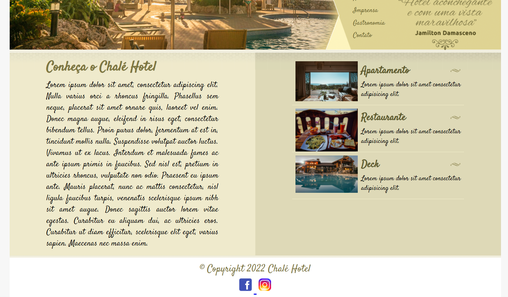
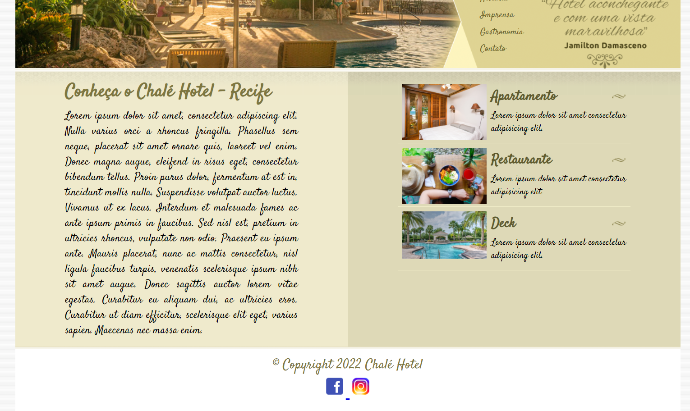
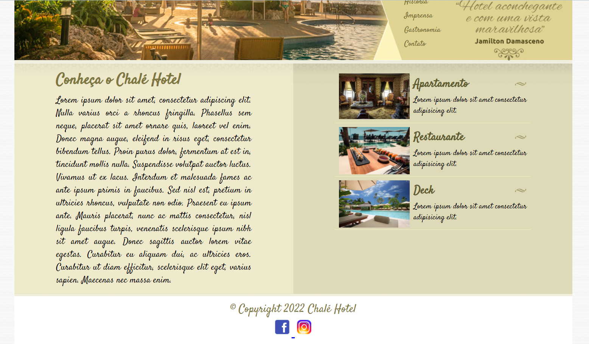
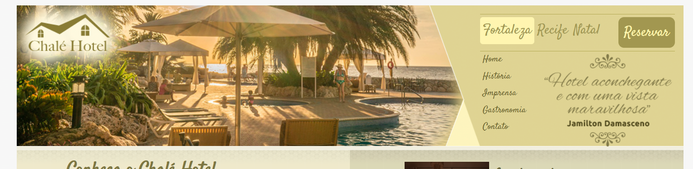

# Projeto Chalé Hotel

Projeto executado durante o módulo de CSS intermediário e Avançado no Curso de Desenvolvimento Web 2022 da Udemy.

Este projeto reflete os aprendizados de Layout liquido, z-index, posições relativas e absolutas, colunas falsas com imagens, bordas arredondadas.

Fotos by Pexels banco de dados gratuitos ( autores nas legendas das fotos) e material cedido pelo curso.

Fonte by Google Fonts: Satisfy

Sugestões de acrescentamento:  desenvolvimento das páginas de navegação home, historia, imprensa,gastronomia,contato.Alem da página de cadastro para fazer reservas no hotel.

Página Index -Fortaleza

Página Recife

Página Natal

Imagem do Topo

